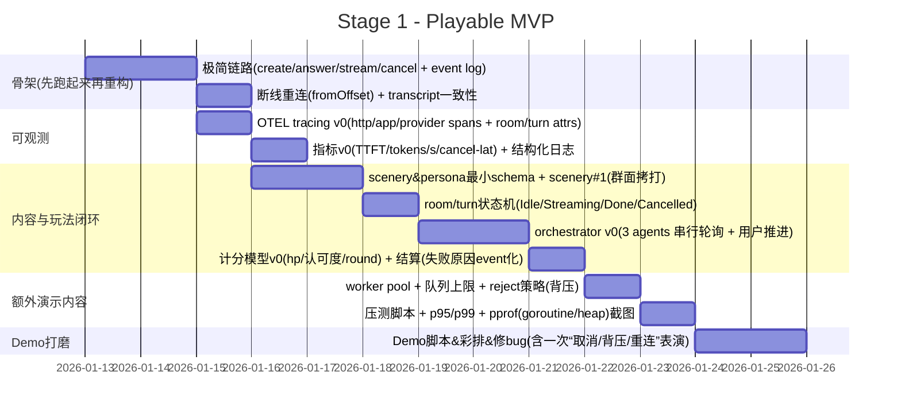
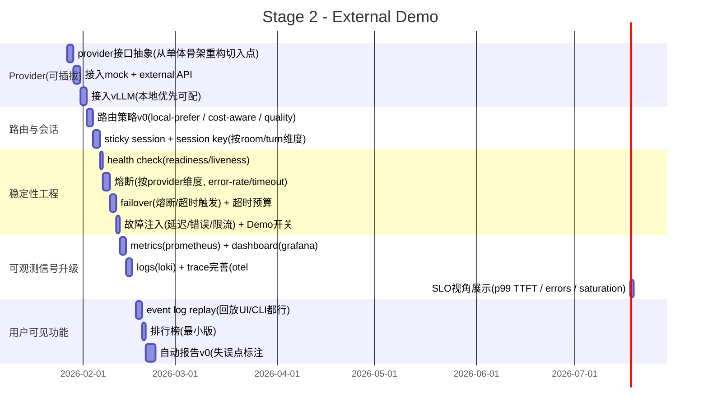
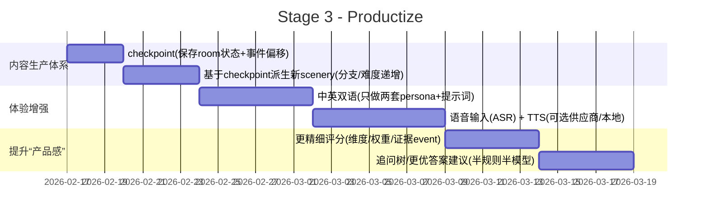

该项目的初衷是为我在 2026Q1 的求职进程中添加 "AI gateway" 的选项可能性，它将会是一个“LLM 网关项目“，包含请求 → 排队 → 合并 → streaming → 限流 → 熔断这些游戏 LLM 网关会需要的场景。

挖掘 AI 的使用场景并且盈利不是我的强项，但如果不考虑盈利，我认为可以玩的点还挺多的。

敬请见证。

---

#### 技术设计原则：

-   使用 SSE 向客户端传输 token 流
-   使用 WS 作为控制面（取消/改参/心跳/查询状态）
-   可拔插的 LLM Provider（vLLM、外部 API、Mock）
-   使用 Grafana+Prometheus+Loki+OpenTelemetry 支撑可观测性，所有关键行为都可观测：排队、熔断、限流、首 token、tokens/s

#### 典型场景

和多个 AI NPC 进行交流，类似群面，但是多个面试官拷打同一个面试者

> 你是面试的 candidate，多个 interview agent 会针对你简历上的内容（其实是我简历上的内容）进行轮番拷打，每个 agent 都有各自的 persona

#### 用户故事(TODO)

#### 核心玩法设计

类似象棋残局，你会面对一个固定的上下文，在此基础上有两种玩法模式：

1. 你需要存活尽可能多的对话轮次（从深度拷打中活下来）
2. 你需要在最少轮次内获得最高认可度（通过你的 SOTA 让 agent 折服于你的艺术！）

##### for example

TODO: 此处应有一张图片或 高清 gif

### Todo List

#### Stage 1, playable MVP

1. **跑通极简骨架**

    - minimal API

        - `POST /rooms`
        - `POST /rooms/:id/answer`
        - `GET /rooms/:id/events` (SSE)
        - `POST /rooms/:id/cancel`

    - SSE 单路流式输出（chunk 级事件）
    - event log（append-only + fromOffset 回放）

2. **打断机制**
    - HTTP/WS cancel，cancel 必须可靠（立即停止 streaming）
    - trace 中标记 cancelled=true
3. **可观测 v0**

    - OTEL tracing

        - http → app → provider 全链路 span
        - attributes: `room.id`, `turn.id`, `provider`, `ttft_ms`
        - first token 作为 span event

    - 最小指标

        - TTFT
        - tokens/s
        - cancel latency

    - 结构化日志（room/turn 维度）

4. **scenery & persona**

    - 最小 schema（Go struct + validate）
    - scenery#1：群面拷打（3 interviewers）
    - persona 要有：

        - archetype
        - system prompt
        - 禁忌/目标

5. **room / turn 状态机**

    - 状态：

        - Idle
        - Streaming
        - Cancelled
        - Done

    - 所有状态变化 → event 化

6. **orchestrator v0**

    - 三个 agent 串行轮询发言
    - 用户回答 → 推进下一轮
    - 支持策略：

        - 串行（v0 默认）
        - 随机（feature flag）

    - 预留接口：

        - 小模型调度（Stage2 再上）

7. **计分模型 + 结算**

    - hp / 认可度 / round
    - 失败原因必须 event 化
    - 回合结束自动结算

---

##### 额外演示内容

8. **并发限流 / 背压**

    - worker pool
    - 队列长度上限
    - reject / degrade 策略
    - trace 标注：

        - rejected
        - queued

9. **压测 & 性能素材**

    - 压测脚本（hey/wrk/自写，都行，跑起来就行）
    - README 输出：

        - p95 / p99 延迟
        - 并发下 TTFT 变化

    - pprof

        - goroutine
        - heap

    - 截图放 README

10. **Demo 打磨**

-   固定演示脚本：

    -   正常流
    -   cancel
    -   背压触发
    -   断线重连

-   录屏 / gif
-   README 演示说明

#### Stage 2, external demo

**阶段目标：网关能力 + 稳定性工程 + 完整可观测**

1. **Provider 抽象**

    - interface 设计
    - mock
    - external API
    - vLLM 本地模型

2. **路由 & 会话**

    - routing:

        - local-prefer
        - cost-aware
        - quality-aware

    - sticky session
    - trace attributes:

        - route_decision
        - cost_score

3. **稳定性工程**

    - health check

        - liveness
        - readiness

    - 熔断

        - error-rate
        - timeout

    - 自动 failover
    - 故障注入

        - 延迟
        - 错误率
        - 限流

    - trace 必须能看到：

        - fallback_reason

4. **可观测升级**

    - metrics → Prometheus
    - dashboard → Grafana
    - logs → Loki
    - tracing → OTEL 完整版

        - baggage
        - span link
        - error semantic

5. **用户可见功能**

    - 排行榜
    - event log replay（UI / CLI 均可）
    - 自动报告 v0

        - 失误点标注
        - rule-based / heuristic

#### Stage 3

阶段目标：高完成度、产品感

1. **checkpoint 系统**

    - 保存：

        - room state
        - event offset

    - 从 checkpoint 派生新 scenery

        - 难度递增
        - 分支剧情

2. **多语种**

    - 中英双语 persona
    - 模拟：

        - 中文思考 → 英文表达

    - 评估：

        - 信息损失

3. **语音交互**

    - ASR
    - TTS
    - latency 统计

4. **教学系统**

    - 更精细评分

        - 多维度
        - 权重
        - 证据 event

    - 追问树
    - 更优答案建议

        - rule + LLM hybrid

#### Gantt

