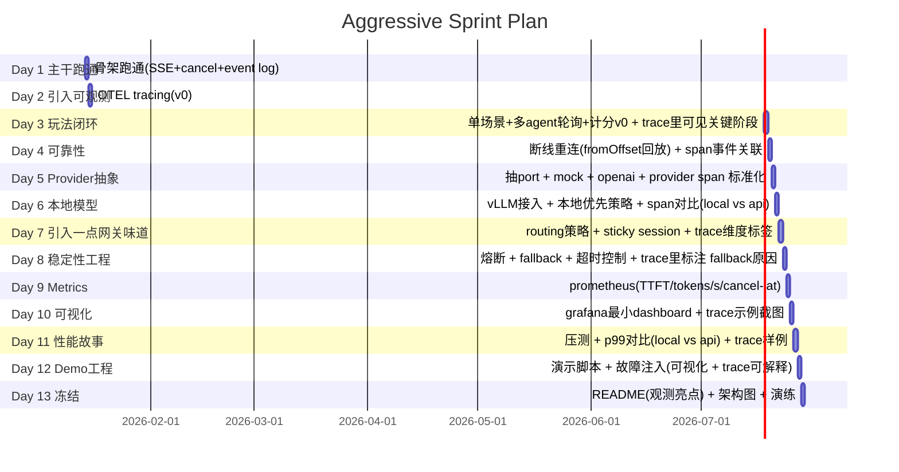

该项目的初衷是为我在 2026Q1 的求职进程中添加 "AI gateway" 的选项可能性，它将会是一个“LLM 网关项目“，包含请求 → 排队 → 合并 → streaming → 限流 → 熔断这些游戏 LLM 网关会需要的场景。

挖掘 AI 的使用场景并且盈利不是我的强项，但如果不考虑盈利，我认为可以玩的点还挺多的。

敬请见证。

---

#### 技术设计原则：

-   使用 SSE 向客户端传输 token 流
-   使用 WS 作为控制面（取消/改参/心跳/查询状态）
-   可拔插的 LLM Provider（vLLM、外部 API、Mock）
-   使用 Grafana+Prometheus+Loki+OpenTelemetry 支撑可观测性，所有关键行为都可观测：排队、熔断、限流、首 token、tokens/s

#### 典型场景

和多个 AI NPC 进行交流，类似群面，但是多个面试官拷打同一个面试者

> 你是面试的 candidate，多个 interview agent 会针对你简历上的内容（其实是我简历上的内容）进行轮番拷打，每个 agent 都有各自的 persona

#### 用户故事(TODO)

#### 核心玩法设计

类似象棋残局，你会面对一个固定的上下文，在此基础上有两种玩法模式：

1. 你需要存活尽可能多的对话轮次（从深度拷打中活下来）
2. 你需要在最少轮次内获得最高认可度（通过你的 SOTA 让 agent 折服于你的艺术！）

##### for example

TODO: 此处应有一张图片或 高清 gif

### Todo List

#### Stage 1, playable MVP

阶段目标：核心玩法验证

1. 定义 scenery&persona 数据结构，制作 scenery#1
2. room/turn 状态机+event log(transcript)
3. SSE 单路流式输出+minimal API(create room / answer / stream / cancel)
4. (hanging)orchestrator: 三个 agent 串行发言+用户回答推进
   考虑中的调度模型：串行调度、随机调度、引入一个更小规模的 LLM 进行调
5. 计分模型(hp/认可度/round)+结算
6. 打断（HTTP cancel / WS）
7. 最小可观测（日志+少量指标）

额外演示内容：

-   并发限流/队列背压（哪怕是简单的 worker pool + 队列长度上限 + reject 策略）

-   压测 + pprof 截图/数据（例如 README 放一张 p95/p99 + goroutine profile ）

#### Stage 2, external demo

阶段目标：可对外展示

1. 抽象 provider (vLLM / external API / mock)
2. 路由策略(prefer local / external / cost aware) + sticky
3. healthy check + 熔断 + 自动 failover + 故障注入(mini 混沌工程)
4. 可观测升级，上 prometheus+grafana+loki+otel
5. 排行榜
6. 基于 event log 的回放
7. 生成基础版报告（失误点标注）

#### Stage 3

阶段目标：高完成度、产品感

1. checkpoint & 派生新的 scenery
2. 多语种（其实只做中英）（用来模拟说中文的“全英”面试）（可能会有信号损失）
3. 语音输入 + TTS
4. 更精细的评分和教学（追问树、更优答案 etc）

#### Gantt

### 项目框架

入口 cmd/server/main.go
| - 加载配置 internal/config/config.go
| - 手动 DI internal/wiring/wiring.go
