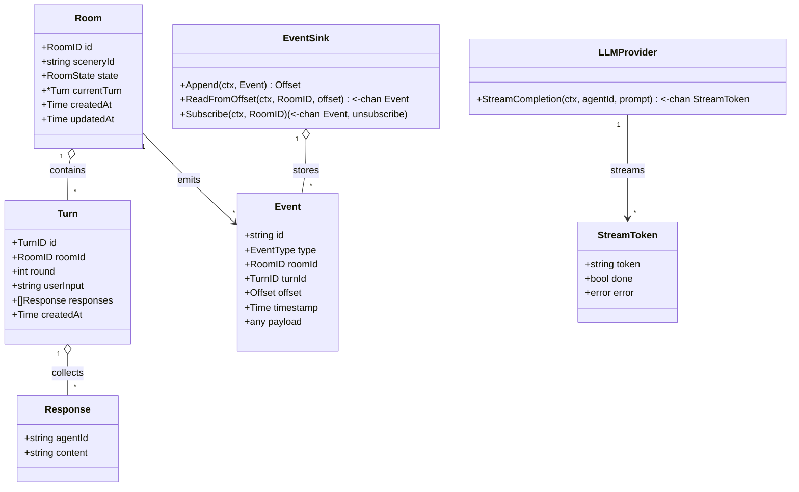
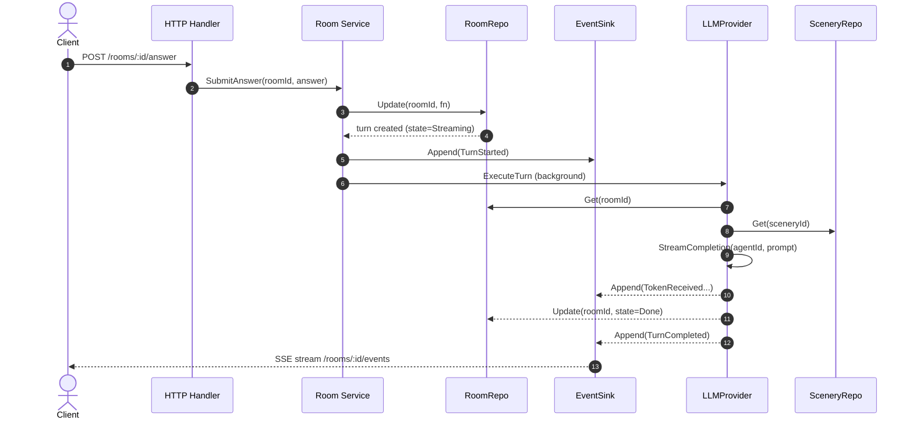
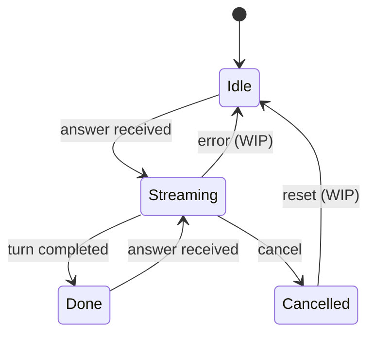
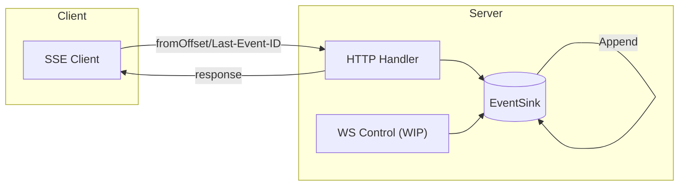

## Overview

### Boot sequence

1.  入口 `cmd/server/main.go`

2.  加载配置 `internal/config/config.go`，优先从 `.env` 加载配置
    - port, timeout
    - LLM provider
    - scenery path

3.  手动 DI `internal/wiring/wiring.go`

    3.1. 加载 Room Repo 实例

    RoomRepo

        - Purpose: 存储room，作为room可变状态的并发边界
        - concurrency: mu保护rooms map，Get返回浅拷贝（指针/浅/深的三选一折衷处理），锁不保证rooms内部字段安全，外部需要视为只读

    ```go
    type RoomRepo struct {
        // 用于保护rooms本身的并发安全
        mu    sync.RWMutex
        rooms map[RoomID]*Room
    }
    ```

    写入 rooms: Save, Update(接受一个函数/闭包)
    读取 rooms: Get(获取浅拷贝而非指针)(严禁修改！)

    3.2. 加载 Event Sink 实例

    ```go
    type EventSink struct {
        // 用于保护events的读写
        mu          sync.RWMutex
        events      map[RoomID][]Event
        subscribers map[RoomID][]chan Event
    }
    ```

    写入 events: Append
    读取 events: ReadFromOffset

    3.3. 加载 LLM Provider 实例

    3.4. 加载 Scenery 实例

    3.5. 加载 Turn Runtime 实例

    3.6. 加载 Room Service 实例

    3.7. 启动 HTTP Server 监听

4.  监听 SIGINT/SIGTERM，收到信号后 shutdown 前最多继续输出 5 秒

### Rule

❌ 在 repo 外部修改 room.*
❌ 跨 goroutine 传递 *Room
❌ 在 Update(fn) 内做 IO / LLM 调用
❌ 在 streaming goroutine 持有 room 引用

## Core data model



## Execution Flow(Req → Turn)



## State machine



Current rules:

- SubmitAnswer allowed only when RoomState is Idle or Done
- Cancel allowed only when RoomState is Streaming
- Cancelled is terminal until reset (WIP)

## Event log



## Streaming

SSE 断线重连语义：

- 使用 fromOffset 或 Last-Event-ID 读取历史事件
- 历史回放与实时订阅必须原子化，避免事件丢失

## Concurrency contract

## Observability

## Failure Modes & Recovery

### Error taxonomy

| 错误类型 | 应定义在 |
| --- | --- |
| 业务规则违反 | Domain 层 |
| 应用流程控制错误 | Application 层 |
| 外部系统失败 | Port（接口定义在 Domain/应用，错误类型通常在 Domain） |
| 技术细节错误（DB timeout / HTTP 500） | Adapter 层 |

## Glossary

名词对齐：

- round
- turn
- session
- scene…

```

```
